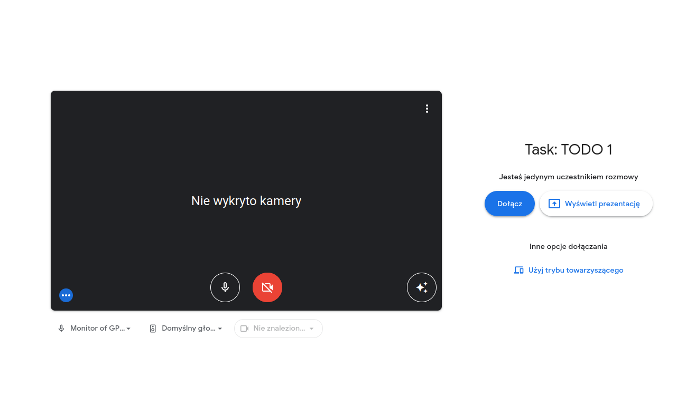

# Workflow
## Opis
Aplikacja webowa do zarządzania zadaniami pracowniczymi. Zintegrowana z platformą Google (Gmail,Calendar,Hangouts)
## Przypadki użycia





## Template
- [Create T3 App](https://create.t3.gg/)
```bash
npm create t3-app@latest
```

## Google Integration
- [Google Calendar API](https://www.youtube.com/watch?v=c2b2yUNWFzI)
- [Google Next Auth](https://www.telerik.com/blogs/how-to-implement-google-authentication-nextjs-app-using-nextauth)
- [Google Calendar - Meet Link](https://gist.github.com/tanaikech/94791d48823e9659aa376cf7f0161d9b#javascript)
- [Google Publish App - OAuth API verification](https://support.google.com/cloud/answer/9110914?hl=pl)
  
## ENV Variables
```bash
cat .env.example > .env
```
- Generate `NEXTAUTH_SECRET`:
  ```bash
  openssl rand -base64 32
  ```
- Add `GOOGLE_CLIENT_ID` & `GOOGLE_CLIENT_SECRET`
- Add `GOOGLE_GMAIL_REFRESH_TOKEN` & `GOOGLE_GMAIL_REDIRECT_URI` & `GOOGLE_GMAIL_USER`

## Upload Files
- lokalnie
- [formidable](https://www.npmjs.com/package/formidable)
- [react-filepond](https://www.npmjs.com/package/react-filepond)
- [Mime types](https://developer.mozilla.org/en-US/docs/Web/HTTP/Basics_of_HTTP/MIME_types/Common_types)
